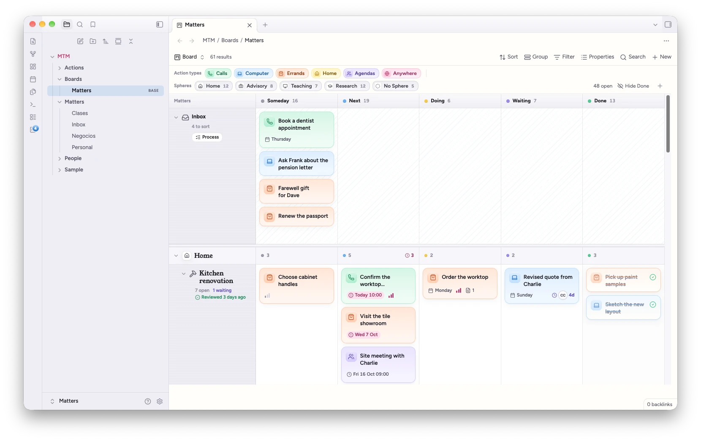
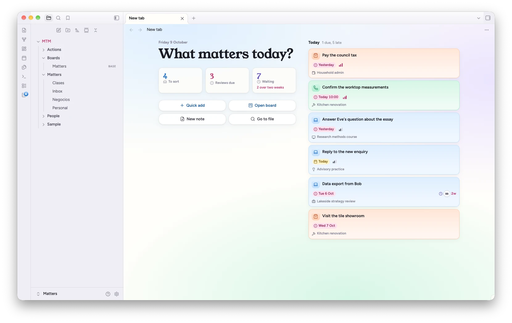
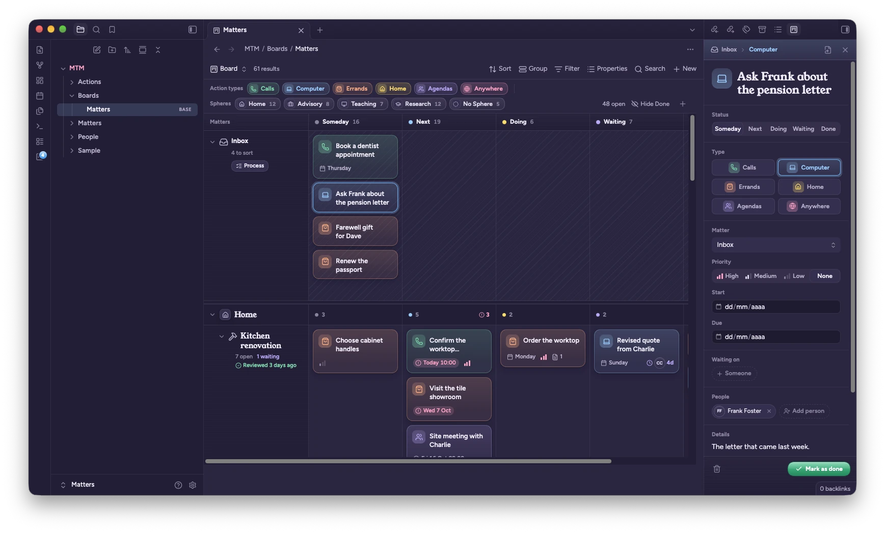
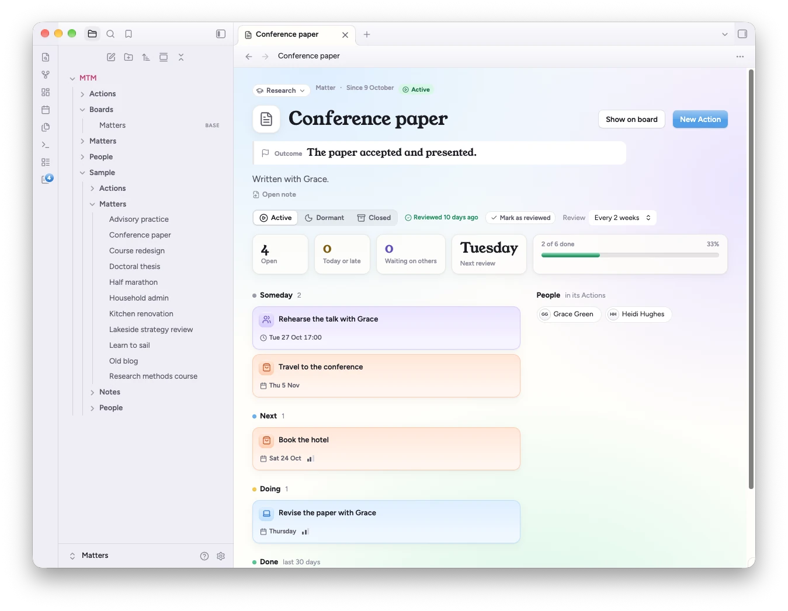
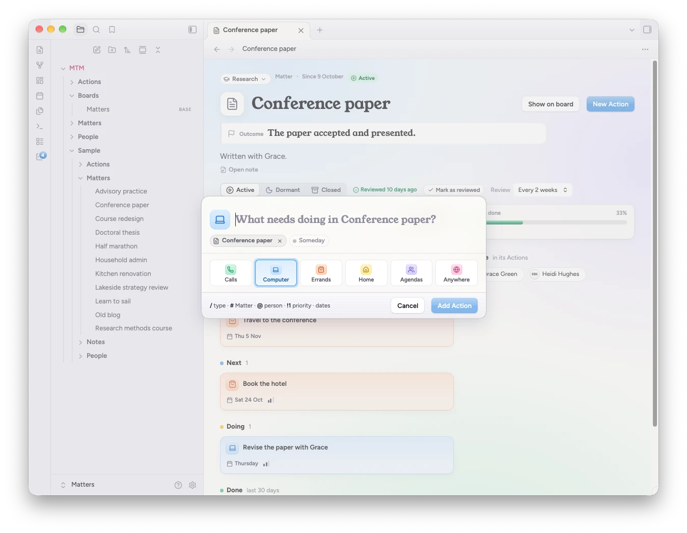
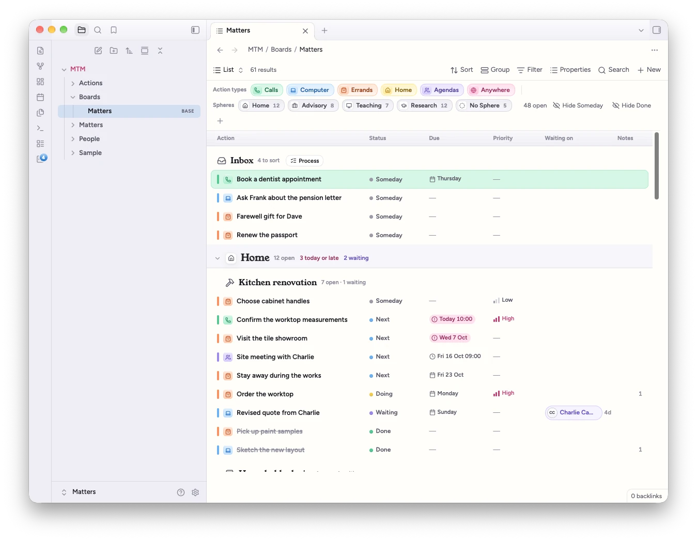
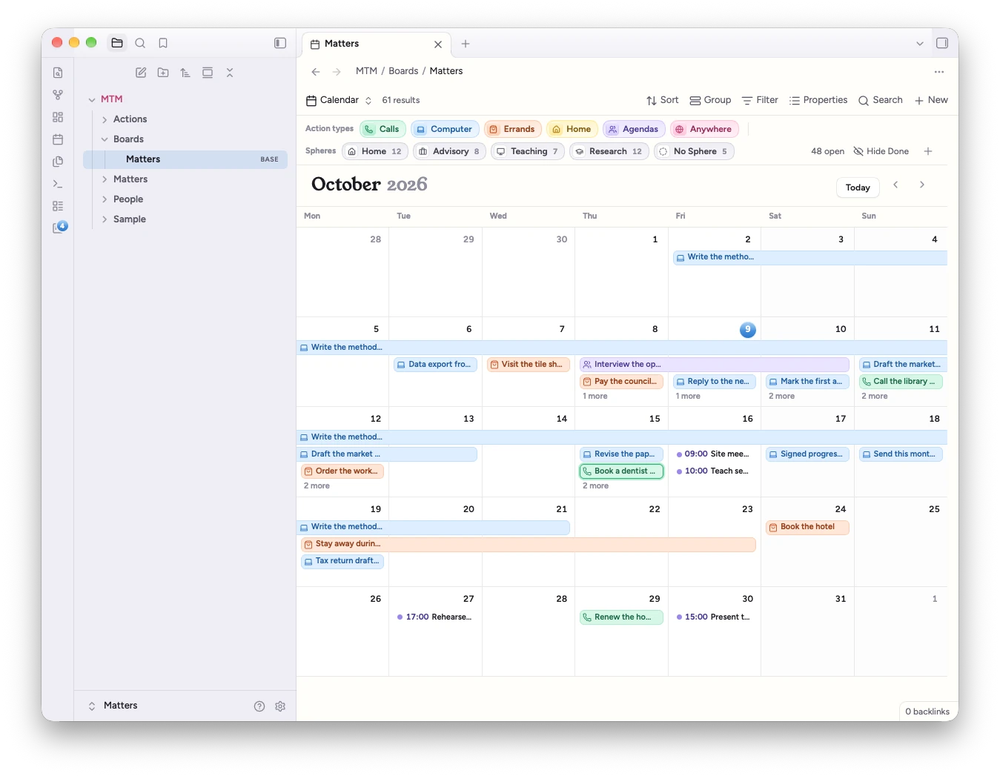
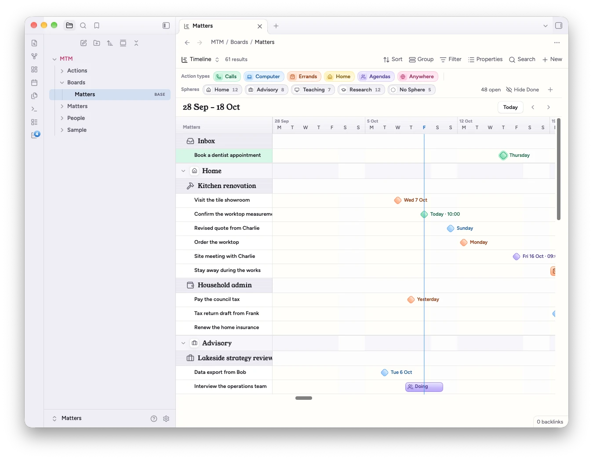
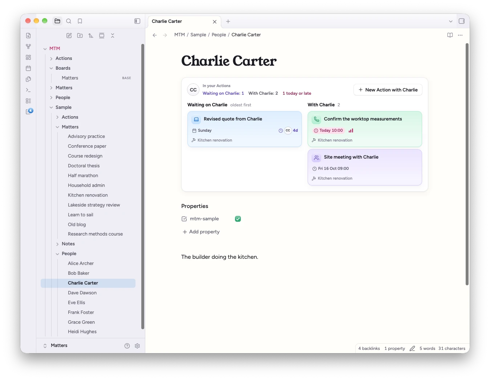
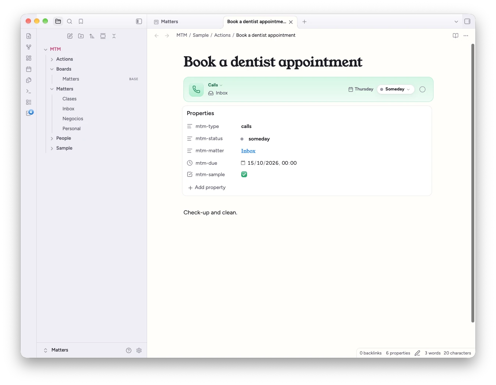

# Matters that Matter

Plan your work in Obsidian on a kanban board with swimlanes, a list, a calendar and a timeline, where every card and every lane is a note.

A **Matter** is anything worth keeping an eye on: a kitchen renovation, the household bills, a thesis. An **Action** is one step that moves a Matter forward. Each Matter is a lane on the board and each Action a card in it. Both are ordinary notes in your vault, so they take part in links, backlinks, search and Bases like anything else.



## Looks best with the Calm Matters theme

Matters that Matter works with any theme. Its companion theme, [Calm Matters](https://community.obsidian.md/themes/calm-matters), gives it the look in these pictures: a warm paper page, Dusk for the evening, a friendly serif for titles and calm, frosted panels, across your whole vault. It changes how things look, not what they do.

To add it: **Settings → Appearance → Themes → Manage**, search for *Calm Matters*, then **Install and use**. Setup offers the same in one click, and so does the top of the plugin's settings.

## Features

- **Four views of the same notes.** Board, list, calendar and timeline are Bases views, so they live in a `.base` file next to your other bases and respect its filters.
- **Swimlanes per Matter**, grouped by Sphere (Home, Work, Family…), with columns for your own statuses. Drag cards between cells, or change them from the inspector.
- **Colour means type.** Action types (call, message, write, meet, buy, visit, or your own) give every card its colour and icon. You choose labels, icons and colours in settings.
- **Quick add** with tokens: `Call Charlie about the worktop /call #Kitchen @Charlie !1 tomorrow 10am`. Dates are read in English and Spanish.
- **The inspector**, in the right sidebar, edits the selected Action: status, type, Matter, priority, dates, who you're waiting on, people, details and a checklist.
- **What matters today?** in every new tab: what's due or late, what's waiting in the Inbox, which Matters are due a review, and long waits.
- **Matter overviews**: the outcome you're aiming for, a review rhythm, progress, and the Matter's Actions by status.
- **Process Inbox** steps through captured Actions one at a time and asks what each one needs.
- **Notes stay notes.** Action notes, Matter notes and the people your Actions name get a small banner that mirrors the card. Everything else in the note is yours.

| | |
|---|---|
|  |  |
|  |  |
|  |  |
|  |  |

All pictures show the Calm Matters theme, with the sample content setup offers.

## Requirements

- **Obsidian 1.13 or later**, on desktop or mobile.
- The **Bases** core plugin turned on (Settings → Core plugins → Bases). Without it, quick add, the inspector and the commands still work, but the board, list, calendar and timeline don't.
- Recommended: the **Calm Matters** theme (see above).

## Installation

1. Open **Settings → Community plugins** and turn off Restricted mode if it's on.
2. Select **Browse**, search for **Matters that Matter**, then select **Install** and **Enable**.

## Getting started

Setup opens in a tab the first time the plugin loads. It creates nothing until the last step, and it never overwrites a file.

1. **Location**: the folders for Matters, Actions, boards and people (`MTM/…` by default). Existing folders are reused.
2. **Workflow**: your statuses, which are the board's columns, and your Action types. Pick a preset (Default, Simple, Get stuff done) or make your own. You can change both later in settings.
3. **Matters**: type a few names, one per line, or adopt notes you already have, by picking them or by folder or tag.
4. **Summary**: every file setup will create or change. Select **Create** to write them and open the board.

Tick **Add sample content** to get a small, made-up life to try every view with: Matters across four Spheres, Actions in every type and status, and the people they involve, with dates relative to today. The command **Remove sample content** moves those notes to the trash.

Then run **Quick add** from the command palette (or give it a hotkey in Settings → Hotkeys) and start capturing.

## How your notes look

Every property the plugin reads or writes starts with `mtm-`, so it never touches a `status` or `type` of your own. Notes are recognised by `mtm-kind`, not by folder, so Matters and Actions can live anywhere in your vault.

```yaml
---
mtm-kind: action
mtm-type: call
mtm-matter: "[[Kitchen renovation]]"
mtm-status: next
mtm-due: 2026-10-15T10:00
mtm-priority: 1
mtm-waiting-on: "[[Charlie Carter]]"
mtm-people:
  - "[[Charlie Carter]]"
---
Confirm the worktop measurements before ordering.

- [ ] Ask for the revised quote
```

The Action's title is its file name. The body is plain Markdown: the inspector shows the text at the top as **Details** and the task items as a **Checklist**, and it never restructures the note.



The plugin never rewrites a value on its own. If an Action names a status, type or Matter that doesn't exist (say, after you delete a status, or before settings have synced), the card shows a badge with the value and the views use a fallback. Nothing is written until you move the Action, dismiss the badge, or run **Fix orphaned Actions**.

## Commands

| Command | What it does |
|---|---|
| Quick add | Captures an Action |
| New Matter | Creates a Matter: name, outcome, review rhythm and Sphere |
| Open board | Opens the board, or lets you choose one if you have several |
| Mark as done | Marks the current Action as done |
| Open Matter overview | Opens the overview of the current Matter note |
| Mark as reviewed | Records today as the current Matter's last review |
| Process Inbox | Steps through the Inbox one Action at a time |
| Run setup | Opens setup again |
| Fix orphaned Actions | Gives every Action with an unknown status, type or Matter the fallback value, after asking |
| Remove sample content | Moves the sample notes to the trash |

No command has a default hotkey.

## Good to know

- **All-day dates in Obsidian's own panels.** `mtm-start` and `mtm-due` hold either a date (`2026-10-15`, all day) or a date and time (`2026-10-15T10:00`). Obsidian's Properties panel and Bases tables show an all-day date as "00:00", and editing it with Obsidian's date picker adds a time, which makes the Action timed. Edit dates in the inspector to keep them all day.
- **Sync your plugin settings.** Statuses, types and Spheres live in the plugin's settings, and notes store their IDs. If your sync doesn't include plugin settings, another device shows badges on those Actions until the settings arrive. Nothing is rewritten in the meantime.
- **Keep links up to date.** Leave Settings → Files and links → **Automatically update internal links** on. Actions point to their Matter with a link, so renaming a Matter should update every Action that names it.
- **Phones.** The board scrolls sideways, and everything you can do by dragging you can also do from the inspector or a lane's menu.

### Obsidian internals

A few features reach into parts of Obsidian that have no public API. Each one is isolated, checks that what it needs is there, and falls back quietly if it isn't:

| Feature | What it touches | Without it |
|---|---|---|
| Date properties | Sets `mtm-start` and `mtm-due` to the Date & time property type (in `.obsidian/types.json`), so Obsidian doesn't treat them as dates only | Dates still work; only Obsidian's own date widgets differ |
| Matters open as their overview | Rewrites what a tab is asked to show before it renders, so Back and Forward work with no flash. Can be turned off in settings | Matter notes open as notes |
| What matters today? | Adds a panel to Obsidian's empty new tab. Can be turned off in settings | New tabs look as usual |
| File explorer | Adds classes to Action entries (a dot in the type's colour) | Entries look as usual |
| The Calm Matters card | Reads the name of the active theme, so setup and settings can say when Calm Matters is in use; its button opens Obsidian's theme browser at the theme through Obsidian's own link handler. It never installs or switches a theme | The card always offers the theme; the button opens the `obsidian://` link instead |

Because Matters and Actions are recognised by `mtm-kind` rather than by folder, the plugin goes through the vault's list of Markdown notes and reads each note's cached properties to find them. It makes no network requests, collects nothing, and reads and writes only inside your vault.

## Development

```bash
npm install
npm run dev    # watch build
npm test
npm run lint
```

`styles.css` is generated from the design sources and committed as a build output; don't edit it by hand.

## Licence

[MIT](LICENSE)
